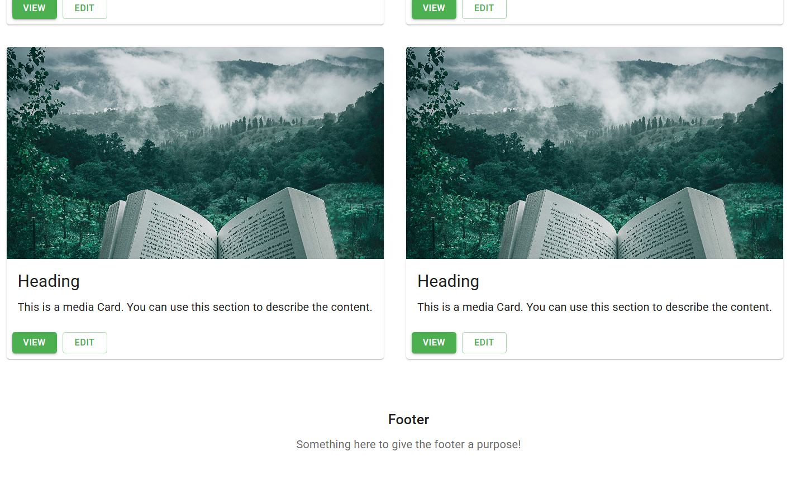

# Material UI Learning Project - Photo Album

This is a **Learning Project** for Material UI, showcasing how to implement a responsive photo album application using React and Material UI components.

## Project Overview

This project demonstrates the use of various Material UI components and features, including:

- Custom theming with a green color palette
- Responsive grid layouts 
- Card components for displaying photos
- AppBar and Toolbar for navigation
- Typography with different variants
- Button components (contained and outlined variants)
- Styling with makeStyles

## Screenshots

Screenshots of the application can be found in the `public/screenshots` directory.

## Available Scripts

In the project directory, you can run:

### `npm start`

Runs the app in the development mode.\
Open [http://localhost:3000](http://localhost:3000) to view it in your browser.

The page will reload when you make changes.\
You may also see any lint errors in the console.

### `npm test`

Launches the test runner in the interactive watch mode.\
See the section about [running tests](https://facebook.github.io/create-react-app/docs/running-tests) for more information.

### `npm run build`

Builds the app for production to the `build` folder.\
It correctly bundles React in production mode and optimizes the build for the best performance.

The build is minified and the filenames include the hashes.\
Your app is ready to be deployed!

See the section about [deployment](https://facebook.github.io/create-react-app/docs/deployment) for more information.
